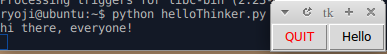
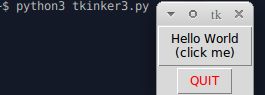
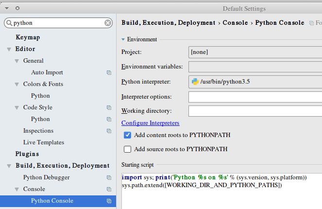
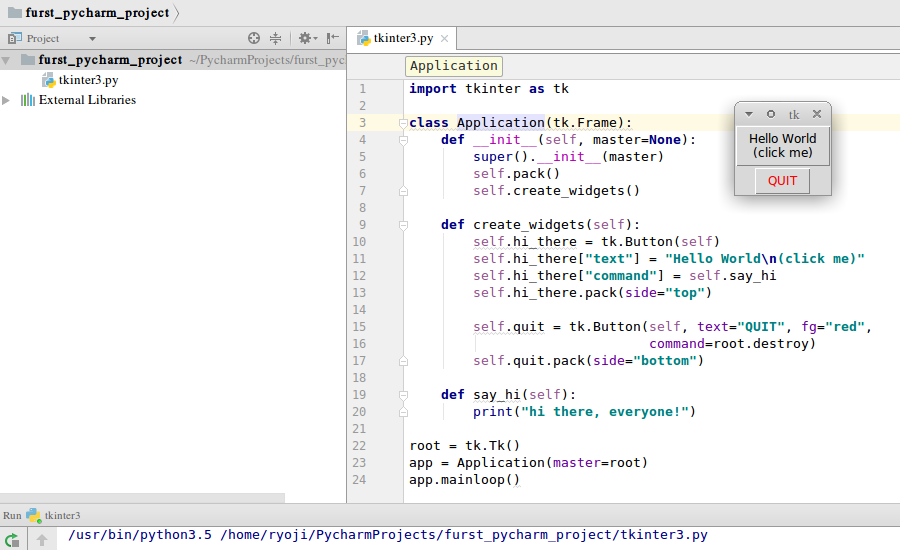

TK, Python3, pyCharm IDE
========================
 * https://www.jetbrains.com/pycharm/download/#section=linux

```
tar xvf pycharm-community-2017.1.4.tar.gz -C ~
```

```
sudo apt-get install python3-pip
sudo apt-get install python3-tk
```

```
ryoji@ubuntu:~$ python --version
Python 2.7.12

$ python3
Python 3.5.2 (default, Nov 17 2016, 17:05:23)
[GCC 5.4.0 20160609] on linux
Type "help", "copyright", "credits" or "license" for more information.
>>>
```

tkinter
-------
https://docs.python.org/3.6/library/tkinter.html





Pycharm IDE's auto complete and document definition viewer work properly.



